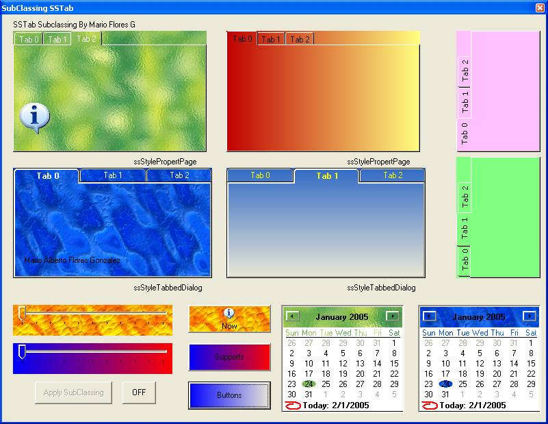



## Cool SStab 2\.0

### Description

Change the Old Appearance of the SSTab Control With Some new Cool Options.

Ok some of the PSC coders ask me to fix some of the bugs on this code, instead I change the Subclass Code … the SStab Control is now more safe , without any vb Crash, and also easy to call the SStab Function.
 
### More Info
 

             |
---                |---
**Submitted On**   |2005-02-01 00:25:42
**By**             |[MArio Flores G](https://github.com/Planet-Source-Code/PSCIndex/blob/master/ByAuthor/mario-flores-g.md)
**Level**          |Intermediate
**User Rating**    |4.8 (135 globes from 28 users)
**Compatibility**  |VB 5\.0, VB 6\.0
**Category**       |[Custom Controls/ Forms/  Menus](https://github.com/Planet-Source-Code/PSCIndex/blob/master/ByCategory/custom-controls-forms-menus__1-4.md)
**World**          |[Visual Basic](https://github.com/Planet-Source-Code/PSCIndex/blob/master/ByWorld/visual-basic.md)
**Archive File**   |[Cool\_SStab184631212005\.zip](https://github.com/Planet-Source-Code/mario-flores-g-cool-sstab-2-0__1-58597/archive/master.zip)

### API Declarations

Of course.

